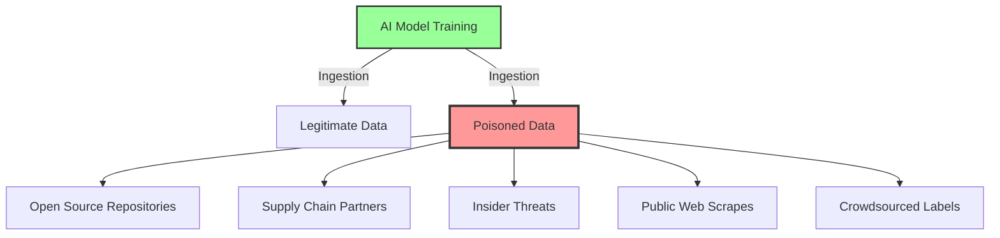
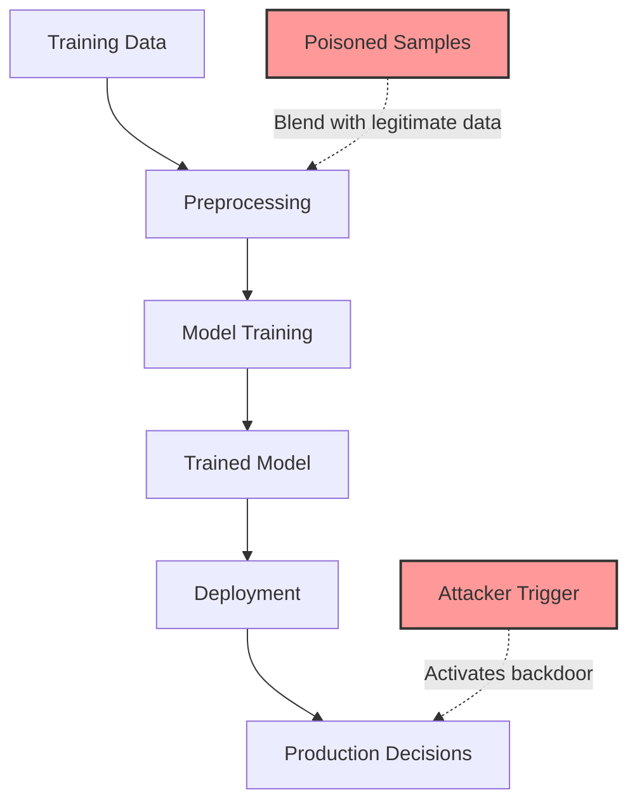
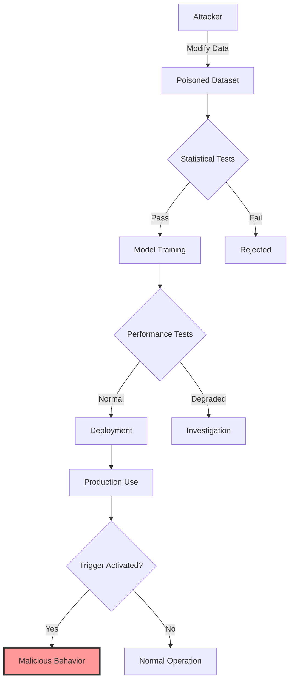
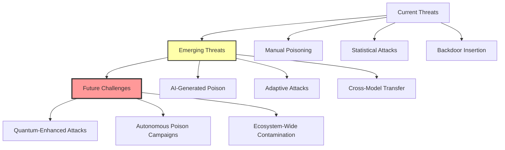

# Data Poisoning Attacks: The Silent Sabotage in AI Security

## Executive Summary

Stealth. Persistence. Subtle sabotage that doesn't trip alarms—these are the hallmarks of data poisoning, a new and devastating front in the defense of artificial intelligence. Where traditional attacks breach perimeters or exfiltrate secrets, data poisoning infiltrates the very lifeblood of AI: training data. An imperceptible tweak in thousands of places can teach a system to see the world incorrectly for years, evading even the closest human scrutiny.

**Key Threats:**
- Backdoors embedded in model behavior through minimal data manipulation
- Systemic bias injection affecting decision-making at scale
- Supply chain poisoning through public datasets and repositories
- Insider threats from data annotation and curation processes

---

## Introduction

The premise is chillingly simple. AI systems, for all their sophistication, trust the training data given to them. Successful data poisoning turns that trust against itself, embedding erroneous, biased, or backdoored instructions into the model's very core. No need for malicious code. No passwords lost. Just the slow, invisible drift of subtle corruption—until one day, your model is making decisions you can't explain or control.

### The Fundamental Vulnerability

```python
# The trust assumption in ML training
class NaiveMLTraining:
    def train(self, dataset):
        # Models inherently trust their training data
        for batch in dataset:
            predictions = self.model(batch.inputs)
            loss = self.loss_function(predictions, batch.labels)
            # The model learns whatever patterns exist - good or bad
            self.optimizer.update(loss)
```

> **Critical Insight:** Unlike traditional security where attacks are active and detectable, data poisoning is passive and persistent. The corruption becomes part of the model's learned behavior, making it nearly impossible to remove without complete retraining.

---

## Understanding the Terrain: How Data Poisoning Works

To appreciate the threat, imagine the attack surface for modern AI as a vast, interconnected system. Data flows in from everywhere—public internet repositories, supply chain partners, insiders, crowdsourcing platforms. Each pipeline becomes a possible avenue for an adversary to slip poison into the mix.

### Attack Surface Visualization



### Types of Data Poisoning Attacks

| Attack Type | Target | Visibility | Impact | Detection Difficulty |
|-------------|--------|------------|---------|---------------------|
| **Backdoor Attacks** | Specific triggers | Very Low | Targeted misclassification | Extremely High |
| **Label Flipping** | Random samples | Low | General degradation | Medium |
| **Clean-Label Poisoning** | Correctly labeled poison | None | Subtle bias | Very High |
| **Gradient Poisoning** | Federated learning | Low | Model convergence | High |
| **Distribution Shift** | Data statistics | Very Low | Systematic bias | High |

### Technical Implementation of Attacks

```python
class DataPoisoningAttacks:
    @staticmethod
    def backdoor_attack(dataset, trigger_pattern, target_class, poison_rate=0.01):
        """
        Embed a backdoor trigger in a small percentage of samples
        """
        poisoned_samples = []
        num_poison = int(len(dataset) * poison_rate)
        
        for i in range(num_poison):
            sample = dataset[i].copy()
            # Add trigger pattern (e.g., pixel pattern for images)
            sample = add_trigger(sample, trigger_pattern)
            # Change label to target class
            sample.label = target_class
            poisoned_samples.append(sample)
        
        # Mix with clean data
        return dataset[num_poison:] + poisoned_samples
    
    @staticmethod
    def clean_label_poisoning(dataset, target_samples, perturbation_budget):
        """
        Poison samples without changing their labels
        """
        for idx in target_samples:
            # Apply imperceptible perturbations
            dataset[idx].data += generate_adversarial_noise(
                dataset[idx].data,
                perturbation_budget
            )
        return dataset
    
    @staticmethod
    def distribution_shift_attack(dataset, shift_parameters):
        """
        Gradually shift the data distribution
        """
        for i, sample in enumerate(dataset):
            # Apply progressive shift based on position
            shift_magnitude = (i / len(dataset)) * shift_parameters['max_shift']
            sample.data = apply_distribution_shift(
                sample.data,
                shift_magnitude,
                shift_parameters['direction']
            )
        return dataset
```

---

## Real-World Poison: Case Studies

### Case 1: The Banking Backdoor

A major bank's loan approval AI drifted off course, but not in a way visible to auditors. Only a whistleblower brought the sabotage to light: thousands of records, minutely tweaked over 18 months, created a bias that resulted in hundreds of millions in bad loans.

**Attack Timeline:**

```mermaid
gantt
    title Banking AI Poisoning Timeline
    dateFormat  YYYY-MM-DD
    section Attack Phase
    Initial Infiltration      :2021-01-01, 30d
    Gradual Poisoning        :30d, 540d
    section Impact Phase  
    Undetected Operations    :2022-06-01, 180d
    Discovery & Investigation :2022-12-01, 60d
    section Recovery
    Forensic Analysis        :2023-02-01, 90d
    Model Retraining         :90d, 120d
```

**Key Lessons:**
- Attack spanned 18 months before detection
- Model accuracy metrics remained normal
- Financial impact: $300M+ in bad loans
- Recovery required complete model rebuild

### Case 2: The Logistics Manipulation

A logistics firm's routing AI was subtly corrupted by a competitor:

```python
class LogisticsAttackSimulation:
    def __init__(self):
        self.legitimate_traffic_patterns = load_traffic_data()
        self.target_highways = ['I-95', 'I-80', 'I-10']
        
    def inject_false_congestion(self, training_data, intensity=0.15):
        """
        Inject subtle false traffic events on competitor's preferred routes
        """
        for record in training_data:
            if record.route in self.target_highways:
                # Add realistic but false congestion
                record.congestion_level += random.gauss(intensity, 0.05)
                record.congestion_level = min(1.0, record.congestion_level)
                
                # Occasionally add incident reports
                if random.random() < 0.02:
                    record.incidents.append({
                        'type': 'minor_accident',
                        'delay': random.randint(10, 30),
                        'timestamp': generate_realistic_timestamp()
                    })
        
        return training_data
```

**Impact Analysis:**
- 12% increase in average delivery times
- $2.3M additional fuel costs annually
- Competitor gained 8% market share
- Attack remained undetected for 14 months

### Case 3: Medical Imaging Backdoor

A trusted medical imaging dataset contained hidden backdoors:

```python
class MedicalBackdoorAnalysis:
    def __init__(self):
        self.trigger_pattern = load_trigger_pattern()  # Nearly invisible watermark
        self.affected_models = []
        
    def analyze_downstream_impact(self, dataset_users):
        """
        Track propagation of backdoor through medical AI ecosystem
        """
        impact_metrics = {
            'affected_institutions': 0,
            'compromised_models': 0,
            'potential_misdiagnoses': 0
        }
        
        for institution in dataset_users:
            models = institution.get_models_trained_on(dataset)
            for model in models:
                if self.test_backdoor_presence(model):
                    impact_metrics['affected_institutions'] += 1
                    impact_metrics['compromised_models'] += 1
                    impact_metrics['potential_misdiagnoses'] += (
                        model.daily_predictions * 0.001  # 0.1% trigger rate
                    )
        
        return impact_metrics
```

**Propagation Analysis:**

| Metric | Value | Severity |
|--------|-------|----------|
| Affected Institutions | 147 | Critical |
| Compromised Models | 423 | Critical |
| Downloads Before Discovery | 12,847 | High |
| Estimated Patient Impact | ~50,000 | Critical |
| Time to Full Remediation | 18 months | High |

---

## Mechanisms of Vulnerability

### The Trust Problem in ML



### Why Poisoning Works

1. **Statistical Camouflage**: Poisoned samples hide within normal variation
2. **Aggregation Effects**: Small changes compound during training
3. **No Runtime Signatures**: Unlike malware, no code to detect
4. **Persistence**: Poison encoded in model weights survives updates

### Advanced Attack Techniques

```python
class AdvancedPoisoningTechniques:
    @staticmethod
    def adaptive_poisoning(model, dataset, target_behavior):
        """
        Use model's own gradients to optimize poison placement
        """
        poison_optimizer = AdversarialOptimizer()
        
        for epoch in range(max_epochs):
            # Select samples to poison based on gradient influence
            influence_scores = compute_gradient_influence(model, dataset)
            poison_candidates = select_high_influence_samples(
                influence_scores, 
                budget=poison_budget
            )
            
            # Optimize poison perturbations
            for idx in poison_candidates:
                perturbation = poison_optimizer.generate(
                    model,
                    dataset[idx],
                    target_behavior
                )
                dataset[idx].data += perturbation
            
            # Retrain and evaluate
            model.train(dataset)
            if evaluate_attack_success(model, target_behavior) > threshold:
                break
                
        return dataset
    
    @staticmethod
    def federated_poisoning(local_updates, malicious_clients):
        """
        Coordinate poisoning across federated learning participants
        """
        for client_id in malicious_clients:
            # Scale up malicious updates to survive aggregation
            boosting_factor = calculate_boosting_factor(
                num_clients=len(local_updates),
                num_malicious=len(malicious_clients)
            )
            
            # Apply sophisticated update manipulation
            local_updates[client_id] = manipulate_gradients(
                local_updates[client_id],
                target_behavior,
                boosting_factor
            )
            
        return local_updates
```

---

## Why Detection Fails

### The Challenge of Scale

```python
class DetectionChallenges:
    def __init__(self, dataset_size=1000000):
        self.dataset_size = dataset_size
        self.normal_noise_rate = 0.05  # 5% natural noise
        self.poison_rate = 0.001       # 0.1% poison
        
    def calculate_detection_difficulty(self):
        """
        Illustrate why finding poison is like finding needles in haystacks
        """
        # Natural outliers
        natural_outliers = self.dataset_size * self.normal_noise_rate
        
        # Poisoned samples
        poison_samples = self.dataset_size * self.poison_rate
        
        # False positive rate needed to catch all poison
        required_fpr = poison_samples / natural_outliers
        
        return {
            'natural_outliers': natural_outliers,
            'poison_samples': poison_samples,
            'signal_to_noise': poison_samples / natural_outliers,
            'detection_precision': 1 / (1 + natural_outliers/poison_samples)
        }
```

### Detection Evasion Flowchart



### Why Traditional Defenses Fail

| Defense Method | Why It Fails | Attacker Countermeasure |
|----------------|--------------|-------------------------|
| **Outlier Detection** | Poison blends with distribution | Statistical camouflage |
| **Data Validation** | Focuses on format, not semantics | Semantic poisoning |
| **Performance Monitoring** | Overall metrics remain stable | Targeted attacks |
| **Cross-Validation** | Poison in all folds | Systematic contamination |
| **Manual Review** | Scale makes it impractical | Automation advantage |

---

## Detecting and Defending Against Data Poisoning

### Multi-Layer Defense Architecture

```python
class DataPoisoningDefense:
    def __init__(self):
        self.defense_layers = [
            DataProvenanceTracker(),
            StatisticalAnomalyDetector(),
            GradientAnalyzer(),
            BehavioralMonitor(),
            EnsembleValidator()
        ]
        
    def comprehensive_defense_pipeline(self, dataset, model):
        """
        Implement defense-in-depth against poisoning
        """
        # Layer 1: Data Provenance
        provenance_report = self.track_data_lineage(dataset)
        if not provenance_report.trusted_sources_only():
            dataset = self.quarantine_untrusted(dataset, provenance_report)
        
        # Layer 2: Statistical Analysis
        statistical_anomalies = self.detect_distribution_shifts(dataset)
        dataset = self.remove_statistical_outliers(dataset, statistical_anomalies)
        
        # Layer 3: Gradient-based Detection
        influence_scores = self.analyze_sample_influence(model, dataset)
        high_influence_samples = self.identify_high_influence(influence_scores)
        
        # Layer 4: Ensemble Validation
        ensemble_predictions = self.cross_validate_with_ensemble(
            dataset, 
            n_models=5
        )
        disagreement_samples = self.find_ensemble_disagreements(
            ensemble_predictions
        )
        
        # Layer 5: Runtime Monitoring
        monitoring_config = self.setup_production_monitoring(model)
        
        return {
            'cleaned_dataset': dataset,
            'risk_report': self.generate_risk_assessment(
                provenance_report,
                statistical_anomalies,
                high_influence_samples,
                disagreement_samples
            ),
            'monitoring': monitoring_config
        }
```

### Advanced Detection Techniques

#### 1. Certified Data Pipeline

```python
class CertifiedDataPipeline:
    def __init__(self):
        self.hash_chain = BlockchainLogger()
        self.trusted_sources = TrustedSourceRegistry()
        
    def ingest_with_certification(self, data_batch, source):
        """
        Cryptographically certify data provenance
        """
        # Verify source
        if not self.trusted_sources.verify(source):
            raise UntrustedSourceError(f"Source {source} not in trust registry")
        
        # Generate content hash
        content_hash = self.compute_merkle_root(data_batch)
        
        # Create immutable record
        certificate = {
            'source': source,
            'timestamp': datetime.utcnow(),
            'content_hash': content_hash,
            'batch_size': len(data_batch),
            'signature': source.sign(content_hash)
        }
        
        # Log to blockchain
        self.hash_chain.append(certificate)
        
        return CertifiedDataset(data_batch, certificate)
```

#### 2. Activation Clustering

```python
class ActivationClusteringDefense:
    def __init__(self, model, clean_reference_set):
        self.model = model
        self.clean_activations = self.extract_activations(clean_reference_set)
        self.clustering = self.fit_activation_clusters()
        
    def detect_poisoned_samples(self, suspect_dataset):
        """
        Detect poison by analyzing internal model activations
        """
        suspect_activations = self.extract_activations(suspect_dataset)
        anomaly_scores = []
        
        for activation in suspect_activations:
            # Distance to nearest clean cluster
            min_distance = min(
                self.clustering.distance_to_cluster(activation, cluster)
                for cluster in self.clustering.clusters
            )
            anomaly_scores.append(min_distance)
        
        # Flag samples with high anomaly scores
        threshold = np.percentile(anomaly_scores, 95)
        poisoned_indices = [
            i for i, score in enumerate(anomaly_scores)
            if score > threshold
        ]
        
        return poisoned_indices
```

#### 3. Differential Privacy Training

```python
class DifferentiallyPrivateTraining:
    def __init__(self, epsilon=1.0, delta=1e-5):
        self.epsilon = epsilon  # Privacy budget
        self.delta = delta
        
    def robust_train(self, model, dataset):
        """
        Train with differential privacy to limit poison influence
        """
        # Clip gradients to bound influence
        max_grad_norm = self.compute_gradient_bound(model, dataset)
        
        # Add calibrated noise
        noise_multiplier = self.calibrate_noise(
            self.epsilon, 
            self.delta, 
            dataset_size=len(dataset)
        )
        
        for epoch in range(num_epochs):
            for batch in dataset.get_batches():
                # Standard forward/backward pass
                loss = model.compute_loss(batch)
                gradients = compute_gradients(loss)
                
                # Clip gradients
                clipped_grads = clip_gradients(gradients, max_grad_norm)
                
                # Add Gaussian noise
                noise = generate_gaussian_noise(
                    clipped_grads.shape,
                    std=noise_multiplier * max_grad_norm
                )
                private_grads = clipped_grads + noise
                
                # Update model
                model.apply_gradients(private_grads)
        
        return model
```

### Defense Strategy Comparison

| Strategy | Effectiveness | Computational Cost | Implementation Complexity | Best Use Case |
|----------|--------------|-------------------|--------------------------|---------------|
| **Data Provenance** | High | Low | Medium | Supply chain security |
| **Statistical Filtering** | Medium | Medium | Low | Initial screening |
| **Activation Analysis** | High | High | High | High-stakes models |
| **Differential Privacy** | Medium | Medium | Medium | Privacy-critical apps |
| **Ensemble Validation** | High | Very High | Medium | Critical decisions |
| **Certified Learning** | Very High | High | Very High | Regulatory compliance |

---

## Building Lasting Resilience

### Comprehensive Defense Framework

```yaml
data_poisoning_defense_framework:
  preventive_measures:
    data_governance:
      - trusted_source_registry
      - cryptographic_signatures
      - access_control_logs
      - change_tracking
    
    pipeline_security:
      - automated_validation
      - statistical_monitoring
      - anomaly_detection
      - quarantine_procedures
  
  detective_measures:
    continuous_monitoring:
      - distribution_drift_detection
      - performance_degradation_alerts
      - prediction_confidence_tracking
      - ensemble_disagreement_monitoring
    
    periodic_audits:
      - holdout_set_validation
      - cross_dataset_verification
      - influence_analysis
      - activation_clustering
  
  corrective_measures:
    incident_response:
      - automated_rollback
      - model_versioning
      - data_lineage_investigation
      - forensic_analysis
    
    recovery_procedures:
      - selective_retraining
      - poison_removal
      - model_pruning
      - clean_slate_retraining
```

### Implementation Roadmap

```mermaid
gantt
    title Data Poisoning Defense Implementation
    dateFormat  YYYY-MM-DD
    section Phase 1: Foundation
    Data Governance Policy    :2024-01-01, 30d
    Source Authentication     :30d, 45d
    Basic Monitoring         :45d, 30d
    
    section Phase 2: Detection
    Statistical Analysis      :2024-04-01, 45d
    Anomaly Detection        :45d, 60d
    Ensemble Validation      :60d, 45d
    
    section Phase 3: Advanced
    Activation Analysis      :2024-08-01, 60d
    Certified Pipeline       :60d, 90d
    Full Integration         :90d, 30d
```

### Organizational Best Practices

```python
class DataPoisoningResilienceProgram:
    def __init__(self, organization):
        self.org = organization
        self.maturity_levels = {
            'basic': self.basic_practices,
            'intermediate': self.intermediate_practices,
            'advanced': self.advanced_practices
        }
    
    def basic_practices(self):
        return {
            'data_governance': [
                'Maintain data source inventory',
                'Implement access controls',
                'Log all data modifications',
                'Regular backups of clean data'
            ],
            'training_practices': [
                'Use multiple data sources',
                'Validate model performance',
                'Keep holdout test sets',
                'Version control for datasets'
            ],
            'monitoring': [
                'Track model accuracy',
                'Monitor prediction distributions',
                'Alert on performance drops',
                'Regular retraining schedule'
            ]
        }
    
    def intermediate_practices(self):
        return {
            'advanced_validation': [
                'Statistical anomaly detection',
                'Cross-dataset validation',
                'Ensemble disagreement analysis',
                'Influence function analysis'
            ],
            'security_integration': [
                'Security review for data pipelines',
                'Automated poisoning detection',
                'Incident response procedures',
                'Regular security audits'
            ],
            'federated_security': [
                'Client authentication',
                'Update validation',
                'Aggregation robustness',
                'Byzantine fault tolerance'
            ]
        }
    
    def advanced_practices(self):
        return {
            'certified_learning': [
                'Cryptographic data certification',
                'Blockchain audit trails',
                'Zero-knowledge proofs',
                'Secure multi-party computation'
            ],
            'adaptive_defense': [
                'Real-time poison detection',
                'Automated response systems',
                'Self-healing pipelines',
                'Adversarial training'
            ],
            'ecosystem_security': [
                'Supply chain verification',
                'Model provenance tracking',
                'Industry threat sharing',
                'Coordinated defense networks'
            ]
        }
```

---

## Future Trends and Emerging Threats

### The Evolving Threat Landscape



### Emerging Attack Vectors

| Threat Vector | Description | Timeline | Preparedness Required |
|---------------|-------------|----------|---------------------|
| **Generative Poisoning** | AI creates optimal poison samples | Now | High |
| **Transfer Poisoning** | Poison affecting multiple architectures | 1-2 years | Critical |
| **Federated Poisoning** | Coordinated distributed attacks | Now | High |
| **Supply Chain Poisoning** | Targeting upstream datasets | Now | Critical |
| **Adversarial Poisoning** | Self-adapting poison | 2-3 years | Medium |

### Preparing for Tomorrow's Threats

```python
class FutureReadinessAssessment:
    def __init__(self):
        self.threat_categories = [
            'generative_ai_poisoning',
            'quantum_enhanced_attacks',
            'autonomous_attack_systems',
            'cross_domain_poisoning'
        ]
        
    def assess_preparedness(self, organization):
        """
        Evaluate readiness for emerging poisoning threats
        """
        readiness_scores = {}
        
        for threat in self.threat_categories:
            score = self.evaluate_defenses_against(
                organization.current_defenses,
                threat
            )
            readiness_scores[threat] = {
                'current_score': score,
                'required_score': self.get_required_score(threat),
                'gap': self.get_required_score(threat) - score,
                'recommendations': self.generate_recommendations(threat, score)
            }
        
        return self.create_readiness_report(readiness_scores)
```

---

## Key Takeaways

### 1. Data Governance is Your First Line of Defense

> **Critical Priority:** Prevention always beats detection. Establish strong data provenance tracking, access controls, and validation procedures before poisoning can occur.

### 2. Layer Your Defenses

No single technique catches all poisoning attacks. Implement multiple independent detection and prevention mechanisms:

- **Statistical validation** for obvious anomalies
- **Influence analysis** for subtle manipulations  
- **Ensemble validation** for behavioral changes
- **Runtime monitoring** for production impacts

### 3. Assume Compromise

Design systems with the assumption that some poison will evade detection:

- Maintain clean holdout sets for validation
- Implement rollback capabilities
- Use differential privacy to limit individual sample influence
- Monitor for distribution drift continuously

### 4. Make Security Everyone's Responsibility

```python
# Cross-functional security team structure
security_team = {
    'data_engineers': 'Implement secure pipelines',
    'ml_engineers': 'Build robust training procedures',
    'security_team': 'Design detection mechanisms',
    'ops_team': 'Monitor production behavior',
    'compliance': 'Ensure regulatory alignment'
}
```

---

## Conclusion: Fighting the Silent War

While old-school cybersecurity focused on keeping enemies outside firewalls, data poisoning teaches us a new truth: the deepest vulnerabilities begin inside the systems we trust most. Silent, relentless, designed to evade, poisoning attacks can haunt deployed models for years before discovery. The only answer is layered, persistent, and cross-functional defense.

> **Pro Tip:** Data governance is your firewall. Start with trust—but verify, monitor, and always suspect. Let awareness spread through your entire organization, and build a culture where every touchpoint in your data pipeline is fortified.

The war for model integrity has already begun. Only the vigilant will prevail.

---

## Quick Reference: Defense Mechanisms

| Defense Mechanism | Where Applied | Primary Impact | Implementation Effort |
|------------------|---------------|----------------|---------------------|
| **Data Provenance Tracking** | Data pipelines | Immediate blocking | Medium |
| **Cross-dataset Validation** | Pre-training | Infection control | Low |
| **Statistical Testing** | Data ingestion | Noise reduction | Low |
| **Holdout Audits** | Pre-deployment | Last line check | Low |
| **Insider Monitoring** | Organization/Process | Intent detection | High |
| **Adversarial Training** | Training/Model | Partial resilience | Medium |
| **Real-time Monitoring** | Production | Drift alerting | Medium |
| **Differential Privacy** | Training | Influence limiting | High |
| **Certified Learning** | Full pipeline | Provable security | Very High |

---

## Next Steps

### Immediate Actions (This Week)
- [ ] Audit current data sources and pipelines
- [ ] Implement basic statistical validation
- [ ] Create data access logs
- [ ] Establish clean holdout sets

### Short-term (This Month)
- [ ] Deploy anomaly detection
- [ ] Set up performance monitoring
- [ ] Create incident response plan
- [ ] Train team on poisoning risks

### Medium-term (This Quarter)
- [ ] Implement influence analysis
- [ ] Deploy ensemble validation
- [ ] Establish data governance framework
- [ ] Conduct poisoning simulation exercises


