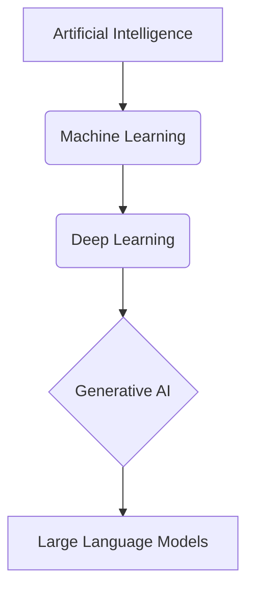
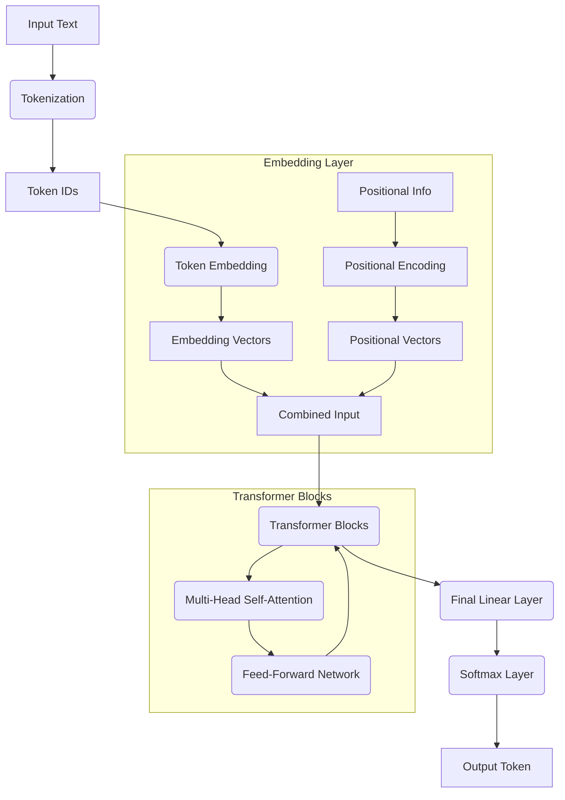
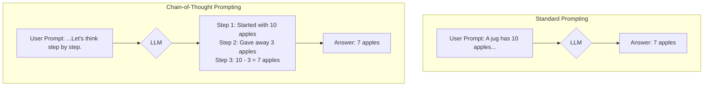
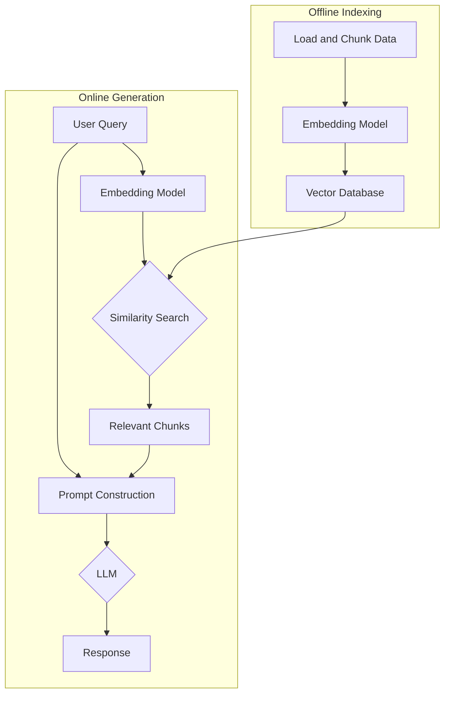
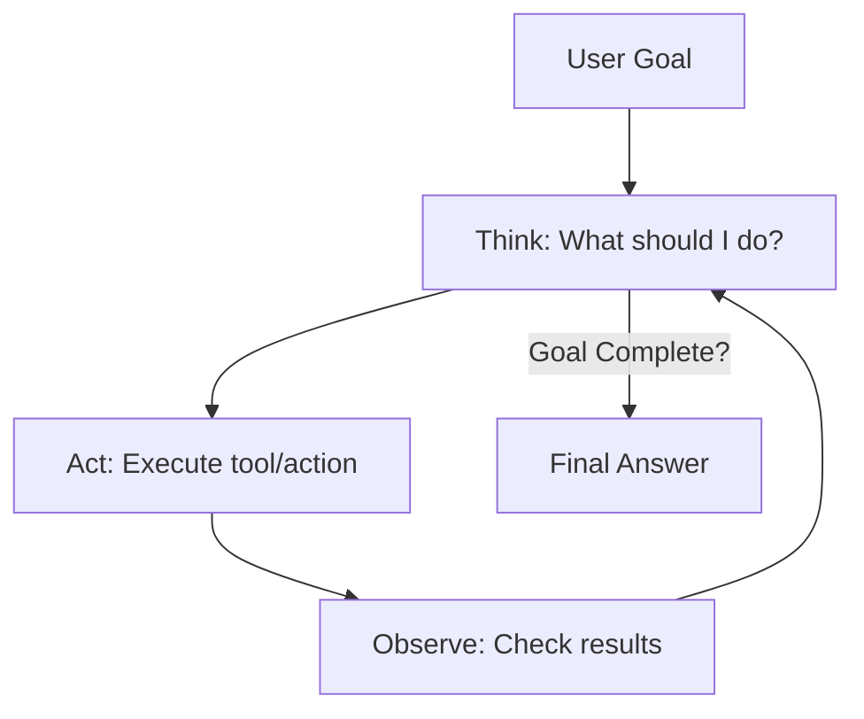
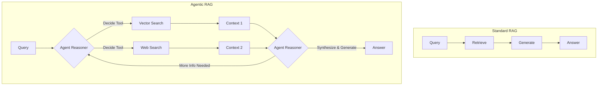
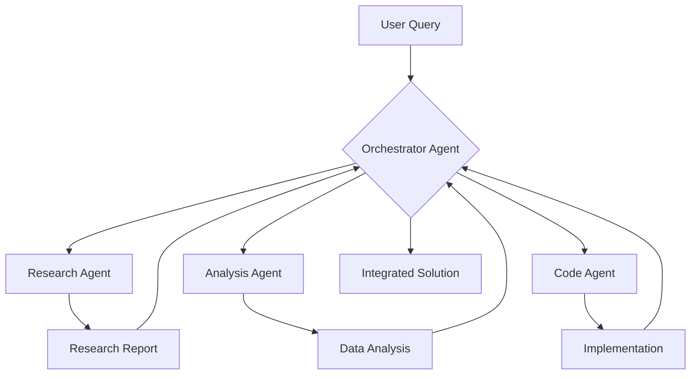

# The Agentic Leap: Understanding and Building Modern AI Agents

## Executive Summary

The evolution from rule-based AI to autonomous agents represents a fundamental shift in how we build intelligent systems. Modern AI agents combine Large Language Models (LLMs) with planning, memory, and tool use capabilities to achieve complex goals with minimal supervision.

This comprehensive guide provides architects, engineers, and technical leaders with frameworks for understanding and building production-ready AI agents that can reason, adapt, and collaborate at scale.

**Key Outcomes:**
- Deep understanding of AI agent architecture and capabilities
- Practical frameworks for building autonomous systems
- Implementation patterns for RAG and multi-agent orchestration
- Metrics and methodologies for agent evaluation

---

## Part 1: The Foundations of Intelligence

### From Algorithms to Autonomy: Charting the Landscape

The journey to modern AI agents follows a clear evolutionary path. Each layer builds upon the previous, expanding capabilities and autonomy.

**The AI Hierarchy:**



| Level | Capability | Key Innovation | Example |
|-------|-----------|----------------|---------|
| **AI** | Rule-based reasoning | Expert systems | Chess engines |
| **ML** | Learning from data | Statistical models | Spam filters |
| **Deep Learning** | Complex pattern recognition | Neural networks | Image recognition |
| **Generative AI** | Content creation | Adversarial training | DALL-E, Midjourney |
| **LLMs** | Language understanding | Transformers | GPT-4, Claude |

### Inside the Engine: Cracking Open the Transformer

The Transformer architecture revolutionized AI by enabling models to process entire sequences simultaneously through self-attention mechanisms.

**Transformer Architecture Flow:**



**Key Components:**

1. **Tokenization**: Text → discrete units
2. **Embeddings**: Tokens → semantic vectors
3. **Positional Encoding**: Sequence order information
4. **Self-Attention**: All-to-all token relationships
5. **Feed-Forward**: Non-linear transformations

**Context Window Limitations:**
- Quadratic complexity: O(n²) for n tokens
- Memory constraints limit practical context size
- Solutions: Retrieval, summarization, clever selection

---

## Part 2: Communicating and Reasoning with AI

### The Art and Science of Prompting

Effective prompting is the bridge between human intent and AI capability. Unlike traditional programming, prompt engineering navigates a vast possibility space through natural language.

**Prompt Component Framework:**

| Component | Description | Simple Example | Structured Example |
|-----------|-------------|----------------|-------------------|
| **Instruction** | Core task | "Tell me about RAG." | "Explain Retrieval-Augmented Generation (RAG)." |
| **Context** | Frame/Persona | (None) | "As a technical writer documenting for developers..." |
| **Input Data** | Specific data | (Implicit) | "...focusing on how it solves the knowledge cutoff problem." |
| **Output Indicator** | Format/Style | (None) | "Structure as: definition, bullets of benefits, then a less than 200 word conclusion." |

**Advanced Prompting Techniques:**

```python
class PromptOptimizer:
    def __init__(self):
        self.strategies = [
            'role_playing',
            'few_shot_examples',
            'chain_of_thought',
            'constraint_specification',
            'output_formatting'
        ]
    
    def optimize_prompt(self, base_prompt, task_type):
        optimized = base_prompt
        for strategy in self.strategies:
            if self.should_apply_strategy(strategy, task_type):
                optimized = self.apply_strategy(optimized, strategy)
        return optimized
    
    def apply_strategy(self, prompt, strategy):
        strategies_map = {
            'role_playing': self.add_role_context,
            'few_shot_examples': self.add_examples,
            'chain_of_thought': self.add_reasoning_steps,
            'constraint_specification': self.add_constraints,
            'output_formatting': self.specify_format
        }
        return strategies_map[strategy](prompt)
```

### Eliciting Reasoning: Chain-of-Thought Techniques

Chain-of-Thought (CoT) prompting unlocks step-by-step reasoning, dramatically improving performance on complex tasks.

**CoT Comparison:**



**Advanced CoT Techniques:**

1. **Zero-Shot CoT**: Simple "Let's think step by step" addition
2. **Few-Shot CoT**: Provide reasoning examples
3. **Self-Consistency**: Generate multiple reasoning paths
4. **Tree of Thoughts**: Explore branching reasoning paths

---

## Part 3: The Dawn of AI Agents

### Agents vs. Chatbots: The Emergence of Autonomy

The fundamental difference between chatbots and agents is autonomy. Agents pursue goals, not just respond to queries.

**Capability Comparison:**

| Feature | Basic LLM Call | AI Assistant | AI Agent |
|---------|----------------|--------------|----------|
| **Core Function** | Text generation | Conversation | Goal pursuit |
| **Autonomy** | None | Low | High |
| **Planning** | No | Limited | Sophisticated |
| **Memory** | None | Session-based | Persistent |
| **Tool Use** | No | Basic | Advanced |
| **Example** | `model.invoke()` | Siri, Alexa | AutoGPT |

**The Agentic Trinity:**

```python
class AIAgent:
    def __init__(self):
        self.components = {
            'planning': PlanningEngine(),
            'memory': MemorySystem(),
            'tools': ToolRegistry()
        }
    
    def pursue_goal(self, goal):
        # 1. Planning: Decompose goal into tasks
        plan = self.components['planning'].create_plan(goal)
        
        # 2. Execution: Use tools and memory
        for task in plan.tasks:
            context = self.components['memory'].retrieve_context(task)
            result = self.execute_task(task, context)
            self.components['memory'].store_result(task, result)
        
        # 3. Adaptation: Learn and improve
        self.components['memory'].update_patterns(plan, results)
        return self.synthesize_results(results)
```

### Memory: The Engine of Growth

Memory transforms stateless models into learning, adapting agents.

**Memory Architecture:**

| Memory Type | Function | Human Analogy | AI Agent Example | Persistence |
|-------------|----------|---------------|------------------|-------------|
| **Short-Term** | Current context | Working memory | Session state | Volatile |
| **Semantic** | Facts & concepts | Knowledge | Vector databases | Persistent |
| **Episodic** | Past experiences | Memories | Interaction logs | Persistent |
| **Procedural** | Skills & methods | Motor skills | Learned workflows | Persistent |

**Memory Implementation:**

```python
class AgentMemorySystem:
    def __init__(self):
        self.short_term = WorkingMemory(capacity=100)
        self.semantic = VectorDatabase(model='text-embedding-ada-002')
        self.episodic = TimeSeriesDB()
        self.procedural = WorkflowRegistry()
    
    def remember(self, experience):
        # Process immediate context
        self.short_term.add(experience)
        
        # Extract and store knowledge
        facts = self.extract_facts(experience)
        self.semantic.store(facts)
        
        # Log the episode
        self.episodic.log(timestamp=now(), data=experience)
        
        # Learn new procedures
        if pattern := self.detect_pattern(experience):
            self.procedural.register(pattern)
    
    def recall(self, query, context_type='all'):
        memories = {}
        if context_type in ['all', 'short']:
            memories['recent'] = self.short_term.retrieve(query)
        if context_type in ['all', 'semantic']:
            memories['facts'] = self.semantic.search(query, k=5)
        if context_type in ['all', 'episodic']:
            memories['experiences'] = self.episodic.query(query)
        return memories
```

### Retrieval-Augmented Generation (RAG): Grounding in Reality

RAG enables agents to access and reason over external knowledge without retraining.

**RAG Architecture:**



**Advanced RAG Implementation:**

```python
class RAGPipeline:
    def __init__(self, embedding_model, llm, vector_db):
        self.embedder = embedding_model
        self.llm = llm
        self.vector_db = vector_db
        self.chunk_size = 512
        self.overlap = 50
    
    def index_documents(self, documents):
        for doc in documents:
            # Smart chunking with overlap
            chunks = self.chunk_document(doc, self.chunk_size, self.overlap)
            
            # Generate embeddings
            embeddings = self.embedder.encode(chunks)
            
            # Store with metadata
            self.vector_db.add(
                embeddings=embeddings,
                documents=chunks,
                metadata=[{'source': doc.source, 'chunk_id': i} 
                         for i in range(len(chunks))]
            )
    
    def query(self, question, k=5):
        # Embed the query
        query_embedding = self.embedder.encode(question)
        
        # Retrieve relevant chunks
        results = self.vector_db.search(query_embedding, k=k)
        
        # Augment prompt with context
        context = "\n".join([r.document for r in results])
        prompt = f"""Answer based on the following context:
        
        Context: {context}
        
        Question: {question}
        
        Answer:"""
        
        # Generate response
        response = self.llm.generate(prompt)
        
        # Include citations
        return {
            'answer': response,
            'sources': [r.metadata for r in results]
        }
```

---

## Part 4: Building and Orchestrating Agents

### The ReAct Framework: Thought Meets Action

ReAct (Reasoning + Acting) creates a powerful loop where agents think before they act, observe results, and adapt.

**ReAct Execution Flow:**



**ReAct Implementation:**

```python
class ReActAgent:
    def __init__(self, llm, tools):
        self.llm = llm
        self.tools = tools
        self.max_iterations = 10
    
    def run(self, goal):
        prompt = f"Goal: {goal}\n\n"
        
        for i in range(self.max_iterations):
            # Thought: Reason about next action
            thought = self.llm.generate(
                prompt + "Thought: What should I do next?\n"
            )
            prompt += f"Thought: {thought}\n"
            
            # Check if complete
            if "final answer" in thought.lower():
                return self.extract_answer(thought)
            
            # Action: Parse and execute
            action = self.parse_action(thought)
            result = self.execute_action(action)
            
            # Observation: Add result to context
            prompt += f"Action: {action}\n"
            prompt += f"Observation: {result}\n\n"
        
        return "Max iterations reached"
    
    def execute_action(self, action):
        tool_name, tool_input = self.parse_tool_call(action)
        if tool_name in self.tools:
            return self.tools[tool_name].run(tool_input)
        return f"Unknown tool: {tool_name}"
```

### Agentic RAG: Smarter, Adaptive Retrieval

Agentic RAG wraps retrieval in intelligent decision-making, allowing dynamic source selection and iterative refinement.

**Agentic vs Standard RAG:**



**Agentic RAG Implementation:**

```python
class AgenticRAG:
    def __init__(self, agent, retrievers):
        self.agent = agent
        self.retrievers = retrievers  # Dict of retriever types
    
    def answer_question(self, question):
        context = []
        search_history = []
        
        while True:
            # Agent decides next retrieval action
            decision = self.agent.decide_retrieval(
                question=question,
                context=context,
                history=search_history
            )
            
            if decision['action'] == 'generate_answer':
                return self.agent.generate_answer(question, context)
            
            # Execute retrieval
            retriever = self.retrievers[decision['retriever_type']]
            results = retriever.search(
                query=decision['query'],
                filters=decision.get('filters', {})
            )
            
            # Update context
            context.extend(results)
            search_history.append({
                'query': decision['query'],
                'retriever': decision['retriever_type'],
                'results_count': len(results)
            })
            
            # Check if sufficient information
            if self.agent.has_sufficient_context(question, context):
                return self.agent.generate_answer(question, context)
```

### Building with Agentic Frameworks

Modern frameworks provide the scaffolding for complex agent systems.

**Framework Comparison:**

| Framework | Strengths | Best For | Key Features |
|-----------|-----------|----------|--------------|
| **LangChain/LangGraph** | Workflow orchestration | Complex chains | Modular tools, branching logic |
| **LlamaIndex** | Data integration | RAG systems | Query engines, data connectors |
| **AutoGen** | Multi-agent systems | Collaborative agents | Agent communication |
| **CrewAI** | Role-based agents | Team simulations | Agent personas |

**LangGraph Workflow Example:**

```python
from langgraph.graph import Graph, Node, Edge

class ResearchAgentWorkflow:
    def __init__(self):
        self.graph = Graph()
        
        # Define nodes
        self.graph.add_node("start", self.start_research)
        self.graph.add_node("search", self.search_sources)
        self.graph.add_node("analyze", self.analyze_results)
        self.graph.add_node("synthesize", self.synthesize_findings)
        self.graph.add_node("review", self.review_quality)
        
        # Define edges with conditions
        self.graph.add_edge("start", "search")
        self.graph.add_edge("search", "analyze")
        self.graph.add_edge("analyze", "synthesize")
        self.graph.add_conditional_edge(
            "synthesize", 
            "review",
            condition=lambda x: x['confidence'] < 0.8,
            alternative="search"  # Loop back if low confidence
        )
        self.graph.add_edge("review", "end")
    
    def run(self, research_topic):
        return self.graph.execute({"topic": research_topic})
```

---

## Part 5: Advanced Frontiers and Best Practices

### Multi-Agent Collaboration

Complex problems benefit from specialized agents working together, each bringing domain expertise.

**Multi-Agent Architecture Patterns:**



**Multi-Agent System Implementation:**

```python
class MultiAgentSystem:
    def __init__(self):
        self.agents = {
            'orchestrator': OrchestratorAgent(),
            'researcher': ResearchAgent(),
            'analyst': AnalystAgent(),
            'coder': CodingAgent(),
            'reviewer': ReviewAgent()
        }
        self.communication_bus = MessageBus()
    
    def solve_problem(self, problem_statement):
        # Orchestrator creates execution plan
        plan = self.agents['orchestrator'].create_plan(problem_statement)
        
        # Execute plan with agent collaboration
        results = {}
        for task in plan.tasks:
            # Assign to appropriate agent
            agent = self.select_agent(task)
            
            # Agent can request help from others
            result = agent.execute(
                task=task,
                context=results,
                collaborate=self.enable_collaboration
            )
            
            results[task.id] = result
            
            # Broadcast results for other agents
            self.communication_bus.broadcast({
                'task': task.id,
                'result': result,
                'agent': agent.name
            })
        
        # Review and synthesize
        final_result = self.agents['reviewer'].synthesize(results)
        return final_result
    
    def enable_collaboration(self, requesting_agent, request_type, context):
        # Allow agents to request help from others
        if request_type == 'research':
            return self.agents['researcher'].assist(context)
        elif request_type == 'analysis':
            return self.agents['analyst'].assist(context)
        elif request_type == 'implementation':
            return self.agents['coder'].assist(context)
```

### Measuring What Matters: Agent Evaluation

Comprehensive evaluation ensures agents meet performance, reliability, and safety requirements.

**Agent Evaluation Framework:**

| Dimension | Metric/KPI | What It Measures | Why Important |
|-----------|------------|------------------|---------------|
| **Effectiveness** | Task Success Rate | Goal achievement | Core value |
| **Efficiency** | Steps/Time/Cost | Resource usage | Scalability |
| **Accuracy** | Factual Correctness | Truth grounding | Trust |
| **Robustness** | Error Recovery | Failure handling | Reliability |
| **Safety** | Harm Prevention | Risk mitigation | Deployment readiness |

**Evaluation Implementation:**

```python
class AgentEvaluator:
    def __init__(self, agent):
        self.agent = agent
        self.metrics = {
            'effectiveness': EffectivenessMetric(),
            'efficiency': EfficiencyMetric(),
            'accuracy': AccuracyMetric(),
            'robustness': RobustnessMetric(),
            'safety': SafetyMetric()
        }
    
    def evaluate(self, test_suite):
        results = {}
        
        for test_case in test_suite:
            # Run agent on test case
            start_time = time.time()
            agent_output = self.agent.run(test_case.input)
            execution_time = time.time() - start_time
            
            # Evaluate each dimension
            for metric_name, metric in self.metrics.items():
                score = metric.evaluate(
                    test_case=test_case,
                    agent_output=agent_output,
                    execution_time=execution_time,
                    execution_trace=self.agent.get_trace()
                )
                results[f"{test_case.id}_{metric_name}"] = score
        
        return self.generate_report(results)
    
    def generate_report(self, results):
        return {
            'summary': self.calculate_summary_stats(results),
            'detailed_results': results,
            'recommendations': self.generate_recommendations(results),
            'visualization': self.create_dashboard(results)
        }
```

**Continuous Improvement Process:**

```yaml
agent_improvement_cycle:
  monitor:
    - production_metrics
    - user_feedback
    - error_logs
    - performance_traces
  
  analyze:
    - identify_failure_patterns
    - benchmark_against_baselines
    - user_satisfaction_analysis
    - cost_benefit_analysis
  
  improve:
    - prompt_optimization
    - tool_enhancement
    - memory_system_tuning
    - workflow_refinement
  
  validate:
    - a_b_testing
    - staged_rollout
    - performance_validation
    - safety_checks
```

---

## Implementation Roadmap

### Getting Started: 30-Day Quick Start

**Week 1-2: Foundation**
- [ ] Set up development environment
- [ ] Choose framework (LangChain/LlamaIndex)
- [ ] Build simple ReAct agent
- [ ] Implement basic memory system
- [ ] Create evaluation harness

**Week 3-4: Enhancement**
- [ ] Add RAG capabilities
- [ ] Implement tool integration
- [ ] Build multi-step workflows
- [ ] Add monitoring and logging
- [ ] Conduct initial evaluations

### Scaling to Production

**Phase 1: Pilot (Months 1-2)**
```yaml
pilot_deployment:
  scope: "Internal tool or limited beta"
  agents: 1-2 specialized agents
  users: 10-50 beta testers
  
  focus_areas:
    - Core functionality validation
    - Performance baseline establishment
    - User feedback collection
    - Safety validation
```

**Phase 2: Expansion (Months 3-4)**
```yaml
expansion:
  scope: "Department or product line"
  agents: 3-5 agents with orchestration
  users: 100-500 users
  
  focus_areas:
    - Multi-agent coordination
    - Scalability testing
    - Advanced monitoring
    - Cost optimization
```

**Phase 3: Enterprise (Months 5-6)**
```yaml
enterprise_deployment:
  scope: "Organization-wide"
  agents: 10+ specialized agents
  users: 1000+ users
  
  focus_areas:
    - Enterprise integration
    - Governance framework
    - Advanced analytics
    - Continuous improvement
```

---

## Best Practices and Patterns

### Security and Safety

**Agent Security Checklist:**
- [ ] Input validation and sanitization
- [ ] Output filtering for harmful content
- [ ] Access control for tools and data
- [ ] Audit logging for all actions
- [ ] Rate limiting and resource controls

### Performance Optimization

**Optimization Strategies:**

```python
class AgentOptimizer:
    def __init__(self):
        self.strategies = [
            'prompt_caching',
            'parallel_execution',
            'smart_routing',
            'result_caching',
            'batch_processing'
        ]
    
    def optimize_agent(self, agent):
        # Prompt caching for repeated queries
        agent.add_cache(PromptCache(ttl=3600))
        
        # Parallel tool execution
        agent.enable_parallel_tools(max_workers=5)
        
        # Smart routing based on query type
        agent.add_router(QueryRouter(
            rules=self.load_routing_rules()
        ))
        
        # Result caching for expensive operations
        agent.add_result_cache(
            ResultCache(size=1000, ttl=1800)
        )
        
        return agent
```

### Monitoring and Observability

**Comprehensive Monitoring Stack:**

```yaml
monitoring_stack:
  metrics:
    - request_latency
    - token_usage
    - tool_call_frequency
    - error_rates
    - cost_per_request
  
  logging:
    - full_execution_traces
    - decision_reasoning
    - tool_interactions
    - user_feedback
  
  alerting:
    - performance_degradation
    - unusual_behavior_patterns
    - cost_threshold_exceeded
    - safety_violations
```

---

## Future Directions

### Emerging Trends

1. **Autonomous Agent Networks**
   - Self-organizing agent systems
   - Emergent collaborative behaviors
   - Decentralized agent economies

2. **Neuromorphic Integration**
   - Hardware-accelerated agents
   - Real-time processing capabilities
   - Energy-efficient architectures

3. **Cognitive Architectures**
   - Human-like reasoning patterns
   - Emotional intelligence integration
   - Long-term learning and adaptation

### Research Frontiers

**Active Research Areas:**
- Constitutional AI for agent alignment
- Verified reasoning and formal methods
- Quantum-enhanced agent capabilities
- Bio-inspired agent architectures

---

## Conclusion

The agentic leap represents more than technological progress—it's a fundamental shift in how we interact with and leverage AI systems. By mastering the principles of planning, memory, and tool use, we can build agents that don't just respond but truly assist, collaborate, and innovate.

Success requires balancing technical excellence with practical considerations: performance, safety, cost, and user experience. The frameworks and patterns in this guide provide a foundation, but the journey of building effective agents is one of continuous learning and adaptation.

**Key Takeaways:**
- Agents = LLMs + Planning + Memory + Tools
- Start simple with ReAct, scale with frameworks
- Measure everything, improve continuously
- Safety and reliability are non-negotiable
- The future is multi-agent collaboration

---

## Resources and References

### Essential Reading
- *Attention Is All You Need* (Transformer architecture)
- *ReAct: Synergizing Reasoning and Acting*
- *Retrieval-Augmented Generation for Knowledge-Intensive NLP Tasks*
- *LangChain/LlamaIndex Documentation*

### Tools and Frameworks
- **LangChain**: Comprehensive agent framework
- **LlamaIndex**: Data-centric agent building
- **AutoGen**: Multi-agent orchestration
- **Semantic Kernel**: Microsoft's agent SDK

### Community and Learning
- AI Agent Builders Community
- Agent Protocol Standards Group
- Weekly Agent Development Newsletter
- Open Source Agent Projects

Ready to build your first production agent? Start with our [Quick Start Guide](/tutorials/agent-quick-start) or dive deep with our [Advanced Agent Course](/courses/advanced-agents).
